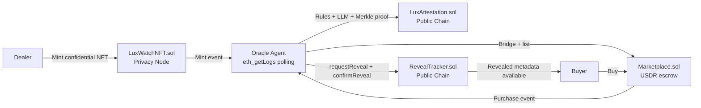

# LuxVerify

Confidential watch authentication on Rayls.

LuxVerify turns a luxury watch into a confidential NFT on a Rayls Privacy Node, runs an AI-assisted authenticity workflow, publishes a public attestation on the Rayls Public Chain, and reveals private metadata only after a buyer completes a purchase.

**Track:** Confidential NFT Reveal  
**Primary chains:** Privacy Node `800005`, Public Chain `7295799`  
**Frontend:** Next.js 14 + Tailwind + TypeScript  
**Contracts:** Foundry + Solidity `0.8.24`

---

## Snapshot

| Who is this for? | What they get |
| --- | --- |
| Dealers | A private mint flow for watch metadata, provenance, service records, and image commitments |
| Buyers | A public certificate with AI score, serial verification status, and reveal only after payment |
| Developers | A full-stack Rayls reference app spanning private NFTs, public attestations, marketplace flows, and an oracle agent |

| Core idea | Why it matters |
| --- | --- |
| Keep sensitive watch data private at mint time | Dealers do not need to expose serials, service notes, or internal evidence before sale |
| Publish only the attestation outcome publicly | Buyers still get a tradable, auditable certificate and marketplace flow |
| Reveal only after purchase | Confidential metadata becomes a buyer entitlement, not a public leak |

---

## Why now

The problem is real, and the market is large:

- Bain estimated the **personal luxury goods** market at **EUR 363 billion in 2024**, while total luxury spending remained near **EUR 1.5 trillion**. Luxury authentication is not a niche workflow anymore; it sits inside a massive global category. [Bain, 2024](https://www.bain.com/insights/luxury-in-transition-securing-future-growth/)
- The Federation of the Swiss Watch Industry reported **CHF 24.8 billion** in Swiss watch exports for **full-year 2024**. Even a narrow slice of high-value watch transactions represents meaningful volume. [FH statistics](https://www.fhs.swiss/statistics.html)
- OECD and EUIPO estimated counterfeit and pirated trade at **USD 467 billion**, or **2.3% of global trade**, based on 2021 data published in 2025. Counterfeit infrastructure is already industrial scale. [OECD/EUIPO, 2025](https://www.oecd.org/en/blogs/2025/10/the-real-cost-of-counterfeits-is-higher-than-you-think.html)
- Deloitte’s **October 8, 2025** Swiss Watch Industry Study surveyed **6,500 consumers** and **111 executives**, underscoring how much watch buying now depends on trust, provenance, and secondary-market confidence. [Deloitte, 2025](https://www.deloitte.com/ch/en/Industries/consumer/perspectives/swiss-watch-industry-study.html)

LuxVerify sits directly at that intersection: private evidence, public trust, and resale-ready attestations.

---

## End User View

### Dealer flow

1. Open the dealer dashboard.
2. Mint a confidential watch NFT with brand, model, reference, serial, caliber, condition, valuation, service notes, and image commitments.
3. Wait for the oracle to detect the mint and score it.
4. Bridge the NFT to the public chain.
5. List the mirrored NFT on the marketplace.

### Buyer flow

1. Browse marketplace listings on the public chain.
2. Check the public attestation before buying.
3. Purchase with USDR.
4. Receive the mirrored NFT and trigger reveal.
5. Access the previously private metadata in the collection flow.

### Verifier flow

1. Enter a token ID on `/verify`.
2. Inspect public summary fields.
3. Read the AI score and explanation.
4. Check whether the serial passed the Merkle-root registry test.
5. Review duplicate or revoked status if applicable.

---

## Private vs Public

| Layer | Data stored there | Why it lives there |
| --- | --- | --- |
| Privacy Node | Serial number, caliber, dial details, service records, image commitments, provenance chain | These are the sensitive facts most likely to leak dealer inventory intelligence or enable copying |
| Public Chain | Attestation summary, AI score, serial verification result, listing status, reveal status | These are the facts buyers need before purchase |

The design goal is simple: **keep proof private until the buyer has earned the right to see it**.

---

## Architecture



---

## Technical View

### Smart contracts

| Contract | Chain | Role |
| --- | --- | --- |
| `src/LuxWatchNFT.sol` | Privacy Node | Confidential ERC-721 storing core watch data, images, service records, and provenance |
| `src/LuxAttestation.sol` | Public Chain | Attestation registry with Merkle serial verification and duplicate detection |
| `src/RevealTracker.sol` | Public Chain | Reveal state machine after purchase |
| `src/Marketplace.sol` | Public Chain | Marketplace escrow and listing logic from the Rayls starter |
| `src/AIReasoningLog.sol` | Public Chain | Full reasoning storage for rules, LLM findings, risk flags, and score components |

### Oracle agent

The TypeScript agent in [`agent/src/index.ts`](./agent/src/index.ts) is the operational glue:

- Polls events with `eth_getLogs`, not WebSockets
- Rebuilds and publishes a Merkle root from [`agent/data/serial-registry.json`](./agent/data/serial-registry.json)
- Runs **7 rule checks** in [`agent/src/validator/rules.ts`](./agent/src/validator/rules.ts)
- Weights the final result **60% rules / 40% LLM** in [`agent/src/validator/scorer.ts`](./agent/src/validator/scorer.ts)
- Writes public attestations and reveal events

### Frontend

The frontend under [`frontend/`](./frontend) already has the right baseline stack:

| Capability | Status |
| --- | --- |
| TypeScript | Present |
| Tailwind CSS | Present |
| Next.js App Router | Present |
| `@/*` path alias | Present |
| `src/` layout | Present |
| shadcn-compatible `ui` folder | Present after current setup under `frontend/src/components/ui` |

Important path notes:

- The correct component path in this repo is **`frontend/src/components/ui`**, not repo-root `/components/ui`, because `@/*` maps to `frontend/src/*`.
- The global styles entry is **`frontend/src/app/globals.css`**.
- A minimal shadcn manifest now lives at **`frontend/components.json`**.

If you want to continue using the shadcn CLI from here:

```bash
cd frontend
npx shadcn@latest add button
```

That keeps imports stable as `@/components/ui/...` and avoids splitting primitives between `src/components` and a separate root-level folder.

---

## Codebase Audit

This repo is strong on the core demo path, but there are a few implementation details worth knowing if you are extending it:

- The privacy NFT, attestation contract, reveal tracker, marketplace flow, and event-polling oracle are all present.
- The validator logic is concrete, not placeholder logic: caliber/reference, production year, material validation, service-history consistency, image count, and related checks are implemented.
- The LLM adapter currently calls **Anthropic** in [`agent/src/validator/llm.ts`](./agent/src/validator/llm.ts). If your target architecture requires OpenAI/Codex specifically, that file is the swap point.
- The bridge and listing flow are still operationally sensitive, because Rayls mirror deployment is asynchronous and depends on registered-user setup and token approval.

---

## Quick Start

### 1. Install dependencies

```bash
forge install
npm install
cd frontend && npm install
cd ../agent && npm install
```

### 2. Configure environment

Use the values in [`AGENTS.md`](./AGENTS.md) as the source of truth.

Required high-signal vars:

```env
PRIVACY_NODE_RPC_URL=...
PUBLIC_CHAIN_RPC_URL=...
DEPLOYER_PRIVATE_KEY=...
REGISTERED_PRIVATE_KEY=...
TOKEN_ADDRESS=...
ATTESTATION_ADDRESS=...
REVEAL_TRACKER_ADDRESS=...
MARKETPLACE_ADDRESS=...
```

### 3. Register the Rayls user and token

Follow the onboarding and token-registration sequence in [`AGENTS.md`](./AGENTS.md). That file already includes the exact `curl` requests and ordering constraints.

### 4. Deploy

```bash
forge script script/DeployLuxWatch.s.sol --rpc-url $PRIVACY_NODE_RPC_URL --broadcast --legacy
forge script script/DeployPublicContracts.s.sol --rpc-url $PUBLIC_CHAIN_RPC_URL --broadcast --legacy
forge script script/DeployMarketplace.s.sol --rpc-url $PUBLIC_CHAIN_RPC_URL --broadcast --legacy
```

### 5. Generate ABIs

```bash
forge build
mkdir -p agent/src/abis
mkdir -p frontend/src/lib/abis
```

Then export the contract ABIs into both the agent and frontend folders.

### 6. Run

```bash
cd agent && npm start
cd ../frontend && npm run dev
```

---

## User-facing Pages

| Route | Purpose |
| --- | --- |
| `/` | Landing page and product narrative |
| `/dealer` | Mint confidential watches and inspect pipeline status |
| `/marketplace` | Browse and buy public-chain listings |
| `/verify` | Token lookup and certificate inspection |
| `/collection` | Revealed metadata after purchase |
| `/activity` | Event feed for attestation, listing, purchase, reveal |

---

## File Map

```text
.
├── agent/
│   ├── data/serial-registry.json
│   └── src/
│       ├── index.ts
│       ├── merkle.ts
│       └── validator/
├── docs/
│   └── CONTRACTS.md
├── frontend/
│   ├── components.json
│   └── src/
│       ├── app/
│       ├── components/
│       │   └── ui/
│       └── lib/
├── script/
└── src/
```

---

## Deep Dives

<details>
<summary>Confidential NFT schema</summary>

`LuxWatchNFT.sol` stores 19 core watch fields in `WatchData`, plus arrays for:

- image commitments
- service records
- provenance entries

This means the public attestation can stay compact while the private record remains rich enough for real verification workflows.

</details>

<details>
<summary>What the oracle actually scores</summary>

The rule engine currently checks:

- caliber vs reference compatibility
- production year plausibility
- serial format sanity
- service history vs age
- condition vs age consistency
- brand/material compatibility
- image count adequacy

Then the LLM adds contextual findings and risk flags before the scorer combines both outputs.

</details>

<details>
<summary>Rayls-specific operational constraints</summary>

- Privacy Node transactions must use `--legacy`
- Mirror deployment can take **30 to 60 seconds**
- The NFT must move from deployer to the registered address before `teleportToPublicChain()`
- Public-chain operations use USDR for gas

</details>

---

## Sources

- [Bain: Luxury in Transition, 2024](https://www.bain.com/insights/luxury-in-transition-securing-future-growth/)
- [Federation of the Swiss Watch Industry: statistics portal](https://www.fhs.swiss/statistics.html)
- [OECD/EUIPO: counterfeit trade scale, 2025 summary](https://www.oecd.org/en/blogs/2025/10/the-real-cost-of-counterfeits-is-higher-than-you-think.html)
- [Deloitte Swiss Watch Industry Study 2025](https://www.deloitte.com/ch/en/Industries/consumer/perspectives/swiss-watch-industry-study.html)
